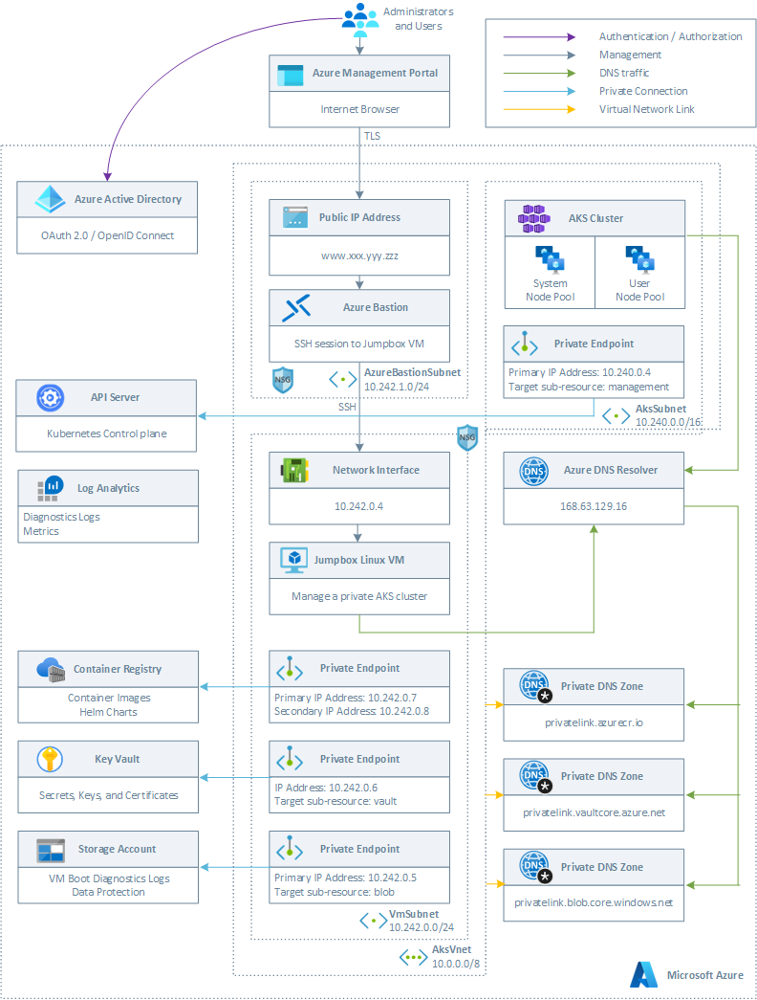

# Everything you want to know about ephemeral OS disks and AKS

This article plus sample analyzes the available configuration settings for the [ephemeral OS disk](https://docs.microsoft.com/en-us/azure/aks/cluster-configuration#ephemeral-os) in [Azure Kubernetes Service](https://docs.microsoft.com/en-us/azure/aks/intro-kubernetes) (AKS). With ephemeral OS disks, you see lower read/write latency on the OS disk of AKS agent nodes since the disk is locally attached. You will also get faster cluster operations like scale or upgrade thanks to faster re-imaging and boot times. This repository contains Bicep modules to deploy and test the combinations described in the remainder of the article. For more information, see the article [Everything you wanted to know on Ephemeral OS disks and AKS](https://techcommunity.microsoft.com/t5/fasttrack-for-azure/everything-you-want-to-know-about-ephemeral-os-disks-and-azure/ba-p/3565605#M205).

## Architecture

This sample provides both a Bicep and ARM template to deploy the following infrastructure on Azure. Both templates provide the ability to deploy a public or a private AKS cluster. In a production environment, we strongly recommend to deploy a [private AKS cluster](https://docs.microsoft.com/en-us/azure/aks/private-clusters) with [Uptime SLA](https://docs.microsoft.com/en-us/azure/aks/uptime-sla). For more information, see [private AKS cluster with a Public DNS address](https://docs.microsoft.com/en-us/azure/aks/private-clusters#create-a-private-aks-cluster-with-a-public-dns-address).



Both the Bicep and ARM template deploy the following Azure resources:

- A private AKS cluster composed of a:
  - System node pool hosting only critical system pods and services. The worker nodes have node taint which prevents application pods from beings scheduled on this node pool.
  - User node pool hosting user workloads and artifacts.
- A new virtual network with four subnets:
  - AksSubnet: this subnet is used for the AKS cluster worker nodes. The VMSS of both the system and user node pools will be created in this subnet. You can change the ARM template or `network.bicep` Bicep module to use a separate subnet for the two node pools.
  - AzureBastionSubnet: a subnet for Azure Bastion
  - VmSubnet: a subnet for the jump-box virtual machine used to connect to the private AKS cluster and for the private endpoints.
- A user-defined managed identity used by the AKS cluster to create additional resources like load balancers and managed disks in Azure.
- A private endpoint to the API server hosted by an AKS-managed Azure subscription. The cluster can communicate with the API server exposed via a Private Link Service using a private endpoint.
- An Azure Bastion resource that provides secure and seamless SSH connectivity to the jump-box virtual machine directly in the Azure portal over SSL
- An Azure Container Registry (ACR) to build, store, and manage container images and artifacts in a private registry for all types of container deployments.
- An Azure Key Vault used by the sample running on AKS to retrieve application settings stored in Key Vault as secrets.
- A private endpoint to the Blob Storage Account used to store the boot diagnostics logs or the virtual machine and the files used by the sample ASP.NET frontend and backend applications for [ASP.NET Data Protection](https://docs.microsoft.com/en-us/aspnet/core/security/data-protection/introduction?view=aspnetcore-6.0).
- A private endpoint to to Azure Container Registry (ACR)
- A private endpoint to Key Vault
- When the ACR sku is equal to Premium, a Private Endpoint is created to allow the private AKS cluster to access ACR via a private IP address. For more information, see [Connect privately to an Azure container registry using Azure Private Link](https://docs.microsoft.com/en-us/azure/container-registry/container-registry-private-link).
- A Private DNS Zone for the name resolution of the private endpoint to the Blob Storage Account
- A Private DNS Zone for the name resolution of the private endpoint to Azure Container Registry (ACR)
- A Private DNS Zone for the name resolution of the private endpoint to Key Vault
- A Virtual Network Link between the virtual network hosting the cluster and the Private DNS Zone to let the cluster to use the `CNAME` and `A` records defined by the Private DNS Zone for the name resolution of the API server of the cluster.
- A jump-box virtual machine to manage the private AKS cluster.
- A Log Analytics workspace to collect the diagnostics logs and metrics from:
  - Azure Kubernetes Service cluster
  - Azure Key Vault
  - Azure Network Security Group
  - Azure Container Registry
  - Azure Storage Account

## Ephemeral OS disks for Azure VMs

Ephemeral OS disks are created on the local virtual machine (VM) storage and not saved to the remote Azure Storage, as when using managed OS disks. For more information on the performance of a managed disk, see [Disk allocation and performance](https://docs.microsoft.com/en-us/azure/virtual-machines/managed-disks-overview). Ephemeral OS disks work well for stateless workloads, where applications are tolerant of individual VM failures but are more affected by VM deployment time or reimaging of individual VM instances. With Ephemeral OS disks, you get lower read/write latency to the OS disk and faster VM reimage.

The key features of ephemeral disks are the following:

- Ideal for stateless applications and workloads.
- Supported by the Azure Marketplace, custom images, and [Azure Compute Gallery](https://docs.microsoft.com/en-us/azure/virtual-machines/shared-image-galleries) 
- Ability to fast reset or reimage virtual machines and scale set instances to the original boot state.
- Lower latency, similar to a temporary disk.
- Ephemeral OS disks are free; you incur no storage cost for OS disks.
- Available in all Azure regions.

The following table remarks the main differences between persistent and
ephemeral OS disks:

|   | Persistent OS Disk | Ephemeral OS Disk |
|---|---|---|
| Size limit for OS disk | 2 TiB | Cache size or temp size for the VM size or 2040 GiB, whichever is smaller. For the cache or temp size in GiB, see [DS](sizes-general.md), [ES](sizes-memory.md), [M](sizes-memory.md), [FS](sizes-compute.md), and [GS](sizes-previous-gen.md#gs-series) |
| VM sizes supported | All | VM sizes that support Premium storage such as DSv1, DSv2, DSv3, Esv3, Fs, FsV2, GS, M, Mdsv2, Bs, Dav4, Eav4 |
| Disk type support| Managed and unmanaged OS disk| Managed OS disk only|
| Region support| All regions| All regions|
| Data persistence| OS disk data written to OS disk are stored in Azure Storage| Data written to OS disk is stored on local VM storage and isn't persisted to Azure Storage. |
| Stop-deallocated state| VMs and scale set instances can be stop-deallocated and restarted from the stop-deallocated state | Not Supported |
| Specialized OS disk support | Yes| No|
| OS disk resize| Supported during VM creation and after VM is stop-deallocated| Supported during VM creation only|
| Resizing to a new VM size| OS disk data is preserved| Data on the OS disk is deleted, OS is reprovisioned |
| Redeploy | OS disk data is preserved | Data on the OS disk is deleted, OS is reprovisioned | 
| Stop/ Start of VM | OS disk data is preserved | Not Supported | 
| Page file placement| For Windows, page file is stored on the resource disk| For Windows, page file is stored on the OS disk (for both OS cache placement and Temp disk placement).|
| Maintenance of VM/VMSS using [healing](understand-vm-reboots.md#unexpected-downtime) | OS disk data is preserved | OS disk data is not preserved  | 
| Maintenance of VM/VMSS using [Live Migration](maintenance-and-updates.md#live-migration) | OS disk data is preserved | OS disk data is preserved  | 

## Placement options for Ephemeral OS disks

You can store ephemeral OS disks on the virtual machine's OS cache disk or temporary storage SSD (also known as resource disk). When deploying a virtual machine or a virtual machine scale set, you can use the [DiffDiskPlacement](https://docs.microsoft.com/en-us/rest/api/compute/virtualmachines/list#diffdiskplacement) property to specify where to place the Ephemeral OS disk, whether in the cache or resource disk.

## Size requirements

As mentioned above, you can choose to deploy ephemeral OS disks on the VM cache or VM temp disk. The image OS disk's size should be less than or equal to the temp/cache size of the VM size chosen.

For example, if you want to opt for **OS cache placement**, the Standard Windows Server images from the Marketplace are about 127 GiB, meaning that you need a VM size with a cache equal to or larger than 127 GiB. The Standard_DS3_v2 has a cache size of 127 GiB, which is large enough. In this case, the Standard_DS3_v2 is the smallest size in the DSv2 series that you can use with this image.

If you want to opt for **Temp disk placement**: the Standard Ubuntu server image from Marketplace is about 30 GiB. The temp disk size must be equal to or larger than 30 GiB to enable Ephemeral OS disk on the temporary storage. Standard_B4ms has a temporary storage size of 32 GiB, which can fit the 30 GiB OS disk. Upon creation of the VM, the temp disk space would be 2 GiB.

If you place the ephemeral OS disk in the temporary storage disk, the final size of the temporary disk will equal the initial size of the temporary disk size minus the OS image size. If you place the ephemeral OS disk in the temporary storage disk, the final size of the temporary disk will equal the initial size of the temporary disk size minus the OS image size. In addition, the ephemeral OS disk will share the IOPS with the temporary storage disk as per the VM size you selected. Ephemeral
disks also require that the VM size supports **Premium storage**. The sizes usually have an s in the name, like DSv2 and EsV3. For more information, see [Azure VM sizes](https://docs.microsoft.com/en-us/azure/virtual-machines/sizes) for
details around which sizes support Premium storage.

> **NOTE**  
> Ephemeral disks will not be accessible through the portal. You will receive a `Resource not Found` or `404` error when trying to access an ephemeral OS disk.

## Unsupported features

Ephemeral OS disks do not support the following features:

- Capturing VM images
- Disk snapshots
- Azure Disk Encryption
- Azure Backup
- Azure Site Recovery
- OS Disk Swap

## AKS and Ephemeral OS disks

Azure automatically replicates data stored in the managed OS disk of a virtual machine to Azure storage to avoid data loss in case the virtual machine needs to be relocated to another host. Generally speaking, containers are not designed to have local state persisted to the managed OS disk, hence this behavior offers limited value to AKS hosted while providing some drawbacks, including slower node provisioning and higher read/write latency. There are a few exceptions where Kubernetes pods may need persisting data to the local storage of the OS disks:

- [EmptyDir](https://kubernetes.io/docs/concepts/storage/volumes/#emptydir): an emptyDir volume is created when a pod is assigned to an agent node, and exists as long as that pod is running on that node. As the name says, the emptyDir volume is initially empty. All containers in the pod can read and write the same files in the emptyDir volume, even if the volume can be mounted at the same or different paths in each container. When a pod is removed from a node, the data in the emptyDir is deleted permanently. EmptyDir volumes can be used in the following scenarios:

  - Checkpointing long computation or data sorting for recovery from crashes
  - Temporary storage area for application logs

> **NOTE**  
> Depending on your environment, emptyDir volumes are stored on any storage system used by agent nodes such as a managed disk or a temporary storage SSD, or a network storage. As we will see in the remainder of this article, AKS provides options to store emptyDir volumes in the OS disk or temporary disk of an agent node.

- [HostPath](https://kubernetes.io/docs/concepts/storage/volumes/#hostpath): hostPath volume mounts a file or directory from the host agent node's filesystem into a pod. HostPath volumes present many security risks, and it is a best practice to avoid using this kind of volume whenever possible. When a HostPath volume must be used, it should be scoped to only the required file or directory, and mounted as ReadOnly. Ephemeral OS disks are stored only on the host machine, hence they provide lower read/write latency, along with faster node scaling and cluster upgrades. Here are a few situations where using a hostPath volume:

  - Running a container that needs access to Docker internals; use a hostPath of /var/lib/docker
  - Running [cAdvisor](https://github.com/google/cadvisor) in a container; use a hostPath of /sys

When a user does not explicitly request managed OS disks (e.g. using the `--node-osdisk-type` Managed parameter in an [az aks create](https://docs.microsoft.com/en-us/cli/azure/aks?view=azure-cli-latest#az-aks-create) or in an [az aks nodepool add](https://docs.microsoft.com/en-us/cli/azure/aks/nodepool?view=azure-cli-latest#az-aks-nodepool-add) command), AKS will default to an ephemeral OS disks whenever possible for a given node pool configuration. The first requisite to use ephemeral OS disks is choosing a VM series this feature, the second requisite is making sure that the OS disk can fit in the VM cache or temporary storage SSD. Let's make a couple of examples with two different VM series:

### DSv2-series

The general purpose [DSv2-series](https://docs.microsoft.com/en-us/azure/virtual-machines/dv2-dsv2-series#dsv2-series) supports or does not support the following features:

- [Premium Storage](https://docs.microsoft.com/en-us/azure/virtual-machines/premium-storage-performance): Supported
- [Premium Storage caching](https://docs.microsoft.com/en-us/azure/virtual-machines/premium-storage-performance): Supported
- [Live Migration](https://docs.microsoft.com/en-us/azure/virtual-machines/maintenance-and-updates): Supported
- [Memory Preserving Updates](https://docs.microsoft.com/en-us/azure/virtual-machines/maintenance-and-updates): Supported
- [VM Generation Support](https://docs.microsoft.com/en-us/azure/virtual-machines/generation-2): Generation 1 and 2
- [Accelerated Networking](https://docs.microsoft.com/en-us/azure/virtual-network/create-vm-accelerated-networking-cli): Supported
- [Ephemeral OS Disks](https://docs.microsoft.com/en-us/azure/virtual-machines/ephemeral-os-disks): Supported
- [Nested Virtualization](https://docs.microsoft.com/en-us/virtualization/hyper-v-on-windows/user-guide/nested-virtualization): Not Supported

This VM Series supports both VM cache and temporary storage SSD. High Scale VMs like [DSv2-series](https://docs.microsoft.com/en-us/azure/virtual-machines/dv2-dsv2-series#dsv2-series) that leverage Azure Premium Storage have a multi-tier caching technology called BlobCache. BlobCache uses a combination of the host RAM and local SSD for caching. This cache is available for the Premium Storage persistent disks and VM local disks. The VM cache can be used for hosting an ephemeral OS disk. When a VM series supports the VM cache, its size depends on the VM series and VM size. The VM cache size is indicated in parentheses next to IO throughput ("cache size in GiB").

| Size | vCPU | Memory: GiB | Temp storage (SSD) GiB | Max data disks | Max cached and temp storage throughput: IOPS/MBps (cache size in GiB) | Max uncached disk throughput: IOPS/MBps | Max NICs|Expected network bandwidth (Mbps) |
|---|---|---|---|---|---|---|---|---|
| Standard_DS1_v2<sup>1</sup> | 1  | 3.5 | 7   | 4  | 4000/32 (43)    | 3200/48   | 2|750   |
| Standard_DS2_v2 | 2  | 7   | 14  | 8  | 8000/64 (86)    | 6400/96   | 2|1500  |
| Standard_DS3_v2 | 4  | 14  | 28  | 16 | 16000/128 (172) | 12800/192 | 4|3000  |
| Standard_DS4_v2 | 8  | 28  | 56  | 32 | 32000/256 (344) | 25600/384 | 8|6000  |
| Standard_DS5_v2 | 16 | 56  | 112 | 64 | 64000/512 (688) | 51200/768 | 8|12000 |

Using the AKS default VM size Standard_DS2_v2 with the default OS disk size of 100 GiB as an example, this VM size supports ephemeral OS disks but only has 86 GiB of cache size. This configuration would default to managed OS disks if the user does not specify explicitly. If a user
explicitly requested ephemeral OS disks, they would receive a validation error.

If a user requests the same Standard_DS2_v2 with a 60 GiB OS disk, this configuration would default to ephemeral OS disks: the requested size of 60GiB is smaller than the maximum cache size of 86 GiB. Using Standard_D8s_v3 with 100 GiB OS disk, this VM size supports ephemeral OS and has 200 GiB of VM cache space. If a user does not specify the OS disk type, the node pool would receive ephemeral OS by default.

> **NOTE**
> When using the Azure CLI to create an AKS cluster or add a node pool to an existing cluster, ephemeral OS requires at least version 2.15.0 of the Azure CLI.

### Ebdsv5-series

The memory optimized [Ebdsv5-series](https://docs.microsoft.com/en-us/azure/virtual-machines/ebdsv5-ebsv5-series#ebdsv5-series)
supports the following features:

- [Premium Storage](https://docs.microsoft.com/en-us/azure/virtual-machines/premium-storage-performance): Supported
- [Premium Storage caching](https://docs.microsoft.com/en-us/azure/virtual-machines/premium-storage-performance): Supported
- [Live Migration](https://docs.microsoft.com/en-us/azure/virtual-machines/maintenance-and-updates): Supported
- [Memory Preserving Updates](https://docs.microsoft.com/en-us/azure/virtual-machines/maintenance-and-updates): Supported
- [VM Generation Support](https://docs.microsoft.com/en-us/azure/virtual-machines/generation-2): Generation 1 and Generation 2
- [Accelerated Networking](https://docs.microsoft.com/en-us/azure/virtual-network/create-vm-accelerated-networking-cli): Supported (required)
- [Ephemeral OS Disks](https://docs.microsoft.com/en-us/azure/virtual-machines/ephemeral-os-disks): Supported
- Nested virtualization: Supported

The last generation VM series don't have both a VM cache and temporary
storage, they only have a larger temporary storage as shown in the
following table.

| Size | vCPU | Memory: GiB | Temp storage (SSD) GiB | Max data disks | Max temp storage throughput: IOPS / MBps | Max uncached storage throughput: IOPS / MBps | Max burst uncached disk throughput: IOPS/MBp | Max NICs | Network bandwidth |
| --- | --- | --- | --- | --- | --- | --- | --- | --- | --- |
| Standard_E2bds_v5 | 2 | 16 | 75 | 4 | 9000/125 | 5500/156 | 10000/1200 | 2 | 10000 |
| Standard_E4bds_v5 | 4 | 32 | 150 | 8 | 19000/250 | 11000/350 | 20000/1200 | 2 | 10000 |
| Standard_E8bds_v5 | 8 | 64 | 300 | 16 | 38000/500 | 22000/625 | 40000/1200 | 4 | 10000 |
| Standard_E16bds_v5 | 16 | 128 | 600 | 32 | 75000/1000 | 44000/1250 | 64000/2000 | 8 | 12500 |
| Standard_E32bds_v5 | 32 | 256 | 1200 | 32 | 150000/1250 | 88000/2500 | 120000/4000 | 8 | 16000 | 
| Standard_E48bds_v5 | 48 | 384 | 1800 | 32 | 225000/2000 | 120000/4000 | 120000/4000 | 8 | 16000 | 
| Standard_E64bds_v5 | 64 | 512 | 2400 | 32 | 300000/4000 | 120000/4000 | 120000/4000 | 8 | 20000 |

Using the Standard_E2bds_v5 with the default OS disk size of 100 GiB as an example, this VM size supports ephemeral OS disks but only has 75 GiB of temporary storage. This configuration would default to managed OS disks if the user does not specify explicitly. If a user explicitly
requested ephemeral OS disks, they would receive a validation error.

If a user requests the same Standard_E2bds_v5 with a 60 GiB OS disk, this configuration would default to ephemeral OS disks: the requested size of 60 GiB is smaller than the maximum temporary storage of 75 GiB. Using Standard_E4bds_v5 with 100 GiB OS disk, this VM size supports
ephemeral OS and has 150 GiB of temporary storage. If a user does not specify the OS disk type, the node pool would receive ephemeral OS by default.

## Use Ephemeral OS on new clusters

You can configure an AKS cluster to use ephemeral OS disks at provisioning time. For example, when creating a new cluster with the Azure CLI, you can use the `--node-osdisk-type Ephemeral` parameter in an [az aks create](https://docs.microsoft.com/en-us/cli/azure/aks?view=azure-cli-latest#az-aks-create) command, as shown below:

```bash
az aks create \
  --name myAksCluster \
  --resource-group myResourceGroup \
  --node-vm-size Standard_DS3_v2 \
  --node-osdisk-type Ephemeral
```

If you want to create a regular cluster using managed OS disks, you can do so by specifying `--node-osdisk-type Managed`.

## Use Ephemeral OS on existing clusters

You can configure a new node pool to use ephemeral OS disks at provisioning time. For example, when creating a new cluster with the Azure CLI, you can use the `--node-osdisk-type Ephemeral` parameter in an [az aks create](https://docs.microsoft.com/en-us/cli/azure/aks?view=azure-cli-latest#az-aks-create) command, as shown below:

```bash
az aks nodepool add \
  --name myNodePool \
  --cluster-name myAksCluster \
  --resource-group myResourceGroup \
  --node-vm-size Standard_DS3_v2 \
  --node-osdisk-type Ephemeral
```

## osDiskType and kubeletDiskType

As we have seen so far, when creating a new AKS cluster or adding a new node pool to an existing cluster, you can use the `osDiskType` parameter
to specify the OS disk type:

- `Ephemeral` (default): the OS disk is created as an ephemeral OS disk in the VM cache or temporary storage, depending on the selected VM series and size.
- `Managed`: the OS disk is created as a network-attached managed disk.

Another setting that you can specify is `kubeletDiskType`. This parameter determines the placement of emptyDir volumes, container runtime data root, and Kubelet ephemeral storage.

- `OS` (default): emptyDir volumes, container runtime data root, and Kubelet ephemeral storage is hosted by the OS disk, no matter if this is managed or ephemeral.
- `Temporary`: emptyDir volumes, container runtime data root, and Kubelet ephemeral storage is hosted by the temporary storage.

I conducted some tests and tried out all the possible combinations of the values for the `kubeletDiskType` and `osDiskType` parameters to understand how the location of container images, emptyDir volumes, container images, and container logs varies depending on the current
selection.

I created four different AKS clusters with the `Standard_D8s_v3 VM` size and four AKS clusters with the `Standard_E16bds_v5` VM size and conducted some tests. You can read the results of my tests in the following post: [Everything you wanted to know on Ephemeral OS disks and AKS](https://techcommunity.microsoft.com/t5/fasttrack-for-azure/everything-you-want-to-know-about-ephemeral-os-disks-and-azure/ba-p/3565605#M205).

## Observations

When using a VM series such as [Dsv3-series](https://docs.microsoft.com/en-us/azure/virtual-machines/dv3-dsv3-series#dsv3-series) that supports both the VM cache and temporary storage:

1. When setting the value of [kubeletDiskType](https://github.com/Azure/azure-rest-api-specs/blob/5582a35deb1bfa4aa22bac8f1d51b7934ead94ac/specification/containerservice/resource-manager/Microsoft.ContainerService/stable/2021-02-01/managedClusters.json#L3846-L3857)
    equal to `OS`, the operating system, container images, emptyDir volumes, writable container layers, and container logs are all hosted in the OS disk, no matter if the OS disk is managed or ephemeral.
2. When setting the value of [kubeletDiskType](https://github.com/Azure/azure-rest-api-specs/blob/5582a35deb1bfa4aa22bac8f1d51b7934ead94ac/specification/containerservice/resource-manager/Microsoft.ContainerService/stable/2021-02-01/managedClusters.json#L3846-L3857) equal to `Temporary`, the operating system is hosted by the OS disk, no matter if the OS disk is managed or ephemeral, while container images, emptyDir volumes, and container logs are hosted by the temporary storage.
3. When setting the [kubeletDiskType](https://github.com/Azure/azure-rest-api-specs/blob/5582a35deb1bfa4aa22bac8f1d51b7934ead94ac/specification/containerservice/resource-manager/Microsoft.ContainerService/stable/2021-02-01/managedClusters.json#L3846-L3857) to `Temporary`, kubelet (e.g., pod logs and emptyDir volumes) and [containerd](containerd.io) (e.g., container images) files are moved to the temporary storage SSD which size depends on the VM size. This configuration may have some caveats: disruptive host failures which could lead to loss of temporary storage disk could end up deleting [kubelet](https://kubernetes.io/docs/reference/command-line-tools-reference/kubelet/) data, which would require AKS to remediate (probably by reimaging).
4. Temporary storage and VM cache have the same performance characteristics. We can conclude that N GiB of temporary storage cost more than N GiB of VM cache/ephemeral OS disk. Hence, deploying a cluster with [osDiskType](https://docs.microsoft.com/en-us/azure/templates/microsoft.containerservice/managedclusters?tabs=bicep) equal to `Ephemeral` and [kubeletDiskType](https://github.com/Azure/azure-rest-api-specs/blob/5582a35deb1bfa4aa22bac8f1d51b7934ead94ac/specification/containerservice/resource-manager/Microsoft.ContainerService/stable/2021-02-01/managedClusters.json#L3846-L3857) equal to OS and setting the [osDiskSize](https://docs.microsoft.com/en-us/azure/templates/microsoft.containerservice/managedclusters?tabs=bicep) equal to the maximum VM cache size is the recommended approach in case you need a lot of ephemeral disk space for container images and emptyDir volumes.

When using a VM series such as Ebdsv5-series](https://docs.microsoft.com/en-us/azure/virtual-machines/ebdsv5-ebsv5-series#ebdsv5-series) that only supports local temporary storage:

1. Using a recent VM series such as [Ebdsv5-series](https://docs.microsoft.com/en-us/azure/virtual-machines/ebdsv5-ebsv5-series#ebdsv5-series) allows you to have a unique, larger temporary storage rather than a smaller, separate temporary storage and VM cache like in [Dsv3-series](https://docs.microsoft.com/en-us/azure/virtual-machines/dv3-dsv3-series#dsv3-series)
2. You can set [osDiskType](https://docs.microsoft.com/en-us/azure/templates/microsoft.containerservice/managedclusters?tabs=bicep) equal to `Ephemeral`, [kubeletDiskType](https://github.com/Azure/azure-rest-api-specs/blob/5582a35deb1bfa4aa22bac8f1d51b7934ead94ac/specification/containerservice/resource-manager/Microsoft.ContainerService/stable/2021-02-01/managedClusters.json#L3846-L3857) equal to `OS`, and the [osDiskSize](https://docs.microsoft.com/en-us/azure/templates/microsoft.containerservice/managedclusters?tabs=bicep) equal to the maximum temporary storage size.
3. Alternatively, you can set [osDiskType](https://docs.microsoft.com/en-us/azure/templates/microsoft.containerservice/managedclusters?tabs=bicep) equal to `Managed` to host the operating system on a premium SSD which size and performance tier depend on the OS disk size and dedicate all the temporary disk to the kubelet data (including emptyDir volumes) and [containerd](containerd.io) data (including container images) by setting [kubeletDiskType](https://github.com/Azure/azure-rest-api-specs/blob/5582a35deb1bfa4aa22bac8f1d51b7934ead94ac/specification/containerservice/resource-manager/Microsoft.ContainerService/stable/2021-02-01/managedClusters.json#L3846-L3857) equal to `Temporary`.

## Show osDiskType and kubeletDiskType for an existing cluster

You can run the following Azure CLI command to find out the `osDiskType`
and `kubeletDiskType` for each node pool of an existing AKS cluster:

```bash
az aks show \
  --name myAksCluster \
  --resource-group myResourceGroup \
  --query 'agentPoolProfiles\[\].{name:name,osDiskType:osDiskType,kubeletDiskType:kubeletDiskType}' \
  --output table \
  --only-show-errors
```

The command returns the `osDiskType` and `kubeletDiskType` for the node
pools of the selected AKS cluster:

```bash
Name    OsDiskType   KubeletDiskType
------- ------------ -----------------
gpu     Managed      OS
keda    Ephemeral    OS
main    Ephemeral    OS
managed Managed      OS
user    Ephemeral    OS
```

## Show osDiskType and kubeletDiskType for a node pool

You can run the following Azure CLI command to find out the `osDiskType`
and `kubeletDiskType` for a given node pool of an existing AKS cluster:

```bash
az aks nodepool show \
  --name user \
  --cluster-name myAksCluster \
  --resource-group myResourceGroup \
  --query '{name:name,osDiskType:osDiskType,kubeletDiskType:kubeletDiskType}' \
  --output table \
  --only-show-errors
```

The command returns the `osDiskType` and `kubeletDiskType` for the specified node pool:

```bash
Name OsDiskType KubeletDiskType
------ ------------ -----------------
user Ephemeral OS
```

## EmptyDir Test

You can use the following YAML manifest to create a pod with three containers, each mounting the same emptyDir volume using a different mount path and writing a separate file to the same directory.

```yaml
apiVersion: v1
kind: Pod
metadata:
  name: emptydir-pod
spec:
  nodeName: node-name
  containers:
  - image: busybox
    imagePullPolicy: IfNotPresent
    name: busybox-1
    resources:
      requests:
        memory: "64Mi"
        cpu: "250m"
      limits:
        memory: "128Mi"
        cpu: "500m"
    command: ['sh', '-c', 'echo "The Bench Container 1 is Running" > /demo1/demo1.txt ; sleep 3600']
    volumeMounts:
    - mountPath: /demo1
      name: demo-volume
  - image: busybox
    imagePullPolicy: IfNotPresent
    name: busybox-2
    resources:
      requests:
        memory: "64Mi"
        cpu: "250m"
      limits:
        memory: "128Mi"
        cpu: "500m"
    command: ['sh', '-c', 'echo "The Bench Container 2 is Running" > /demo2/demo2.txt ; sleep 3600']
    volumeMounts:
    - mountPath: /demo2
      name: demo-volume
  - image: busybox
    imagePullPolicy: IfNotPresent
    name: busybox-3
    resources:
      requests:
        memory: "64Mi"
        cpu: "250m"
      limits:
        memory: "128Mi"
        cpu: "500m"
    command: ['sh', '-c', 'echo "The Bench Container 3 is Running" > /demo3/demo3.txt ; sleep 3600']
    volumeMounts:
    - mountPath: /demo3
      name: demo-volume
  volumes:
  - name: demo-volume
    emptyDir: {}
```

## Next Steps

- [Configurations for local ephemeral storage | Kubernetes Documentation](https://kubernetes.io/docs/concepts/configuration/manage-resources-containers/#configurations-for-local-ephemeral-storage)
- [KubeletDiskType | Azure REST API Documentation](https://docs.microsoft.com/en-us/rest/api/aks/managed-clusters/create-or-update#kubeletdisktype)
- [Microsoft.ContainerService/managedClusters/agentPools Resource Provider | Azure Documentation](https://docs.microsoft.com/en-us/azure/templates/microsoft.containerservice/managedclusters/agentpools?tabs=bicep)

## Conclusion

The recommended configuration is using the [osDiskType](https://docs.microsoft.com/en-us/azure/templates/microsoft.containerservice/managedclusters?tabs=bicep) equal to `Ephemeral`, [kubeletDiskType](https://github.com/Azure/azure-rest-api-specs/blob/5582a35deb1bfa4aa22bac8f1d51b7934ead94ac/specification/containerservice/resource-manager/Microsoft.ContainerService/stable/2021-02-01/managedClusters.json#L3846-L3857) equal to `OS`, and the [osDiskSize](https://docs.microsoft.com/en-us/azure/templates/microsoft.containerservice/managedclusters?tabs=bicep) equal to the maximum VM cache or temporary storage size, depending on the VM series selected for the agent nodes.

## Thanks

If you want to provide a feedback or suggest an improvement, please submit an issue or a pull request on this repository. If you found this article and companion sample useful, please like the repo and related [article](https://techcommunity.microsoft.com/t5/fasttrack-for-azure/everything-you-want-to-know-about-ephemeral-os-disks-and-azure/ba-p/3565605#M205), thanks!
